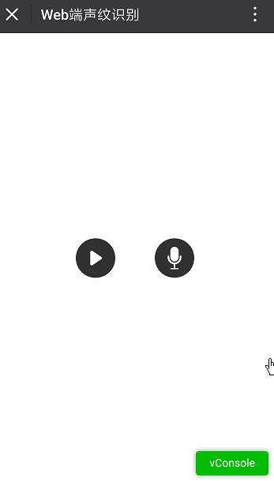
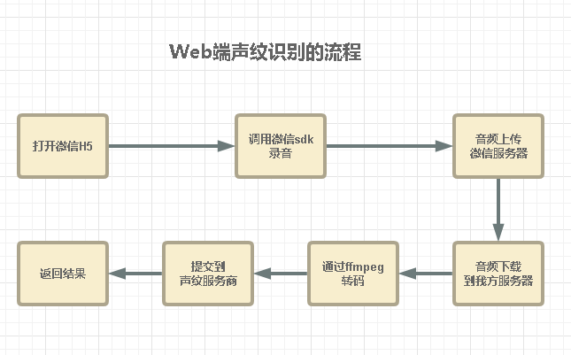
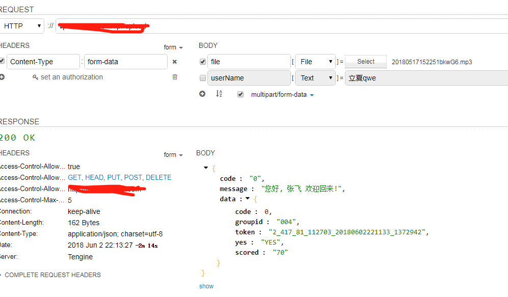

Web端声纹识别


最近做一个微信的口令红包的功能，准备都要投入使用了， 老板突然发愁，他说 现在的羊毛党这么猖狂，一不小心，10万的推广红包，会不会两天就挨刷完了? ....那我们能否做一个功能校验一下是否同一个人来领取红包，不就得了吗? 他一拍脑袋，接着说，Tom 你给我们做一个声纹识别吧!

<br/><br/>
说干就干，在寻找 声纹识别服务商，发现什么科大讯飞，还什么BAT等许多大厂都没有支持Web端的，后来找到一个不知名的小厂。。
<br/><br/>


利用声纹注册成功用户


<br/><br/>

利用声纹登录



<br/><br/>

具体的流程如下：


<br/><br/>

上传文件识别：


**服务端**

因为声纹识别服务商 不能直接使用客户端直接调用 和 音频不支持的问题，要开发自己的服务端来对接。

技术栈 koa + co-wecaht-api + mysql + ffmpeg + pm2 + knex

注：因服务商不支持微信amr文件， 要用ffmpeg 把微信的音频amr文件转码成wav。

以下是一些相关的代码，，开撸。。


微信jssdk开发 如果你微信API这一块已经很熟悉了，跳到下一节
<br/><br/>

获取微信token
```
var api = await new WechatAPI(
	config.appid,
	config.appsecret,
	async () => {
		// 传入一个获取全局token的方法
		var txt = await fs.readFile("./token/access_token.txt", "utf8");
		return JSON.parse(txt);
	},
	async token => {
		// 请将token存储到全局，跨进程、跨机器级别的全局，比如写到数据库、redis等
		// 这样才能在cluster模式及多机情况下使用，以下为写入到文件的示例
		await fs.writeFile("./token/access_token.txt", JSON.stringify(token));
	}
);
```

注：如果报读取不了token文件，就手动在相应的目录，新建的文本文件, 比如 access_token.txt

<br/><br/>

获取微信签名
```
var jsapi_ticket = await api.getLatestTicket();
let nonce_str = 'abcdefg';    // 密钥，字符串任意，可以随机生成
let timestamp = parseInt(new Date().getTime() / 1000) + '';  // 时间戳
let url = ctx.request.body.url;   // 使用接口的url链接，不包含#后的内容
let str = 'jsapi_ticket=' + jsapi_ticket.ticket + '&noncestr=' + nonce_str + '&timestamp=' + timestamp + '&url=' + url;
let signature = sha1(str);

ctx.body = {
    appId: config.appid,
    timestamp: timestamp,
    nonceStr: nonce_str,
    signature: signature
}
```
<br/>

微信调用域名白名单在这里设置
https://mp.weixin.qq.com

设置 > 公众号设置 > 功能设置 > JS接口安全域名


跨域请求
```
const Koa = require("koa");
const app = new Koa();
const cors = require("koa-cors");
.....
app.use(
	cors({
		origin: "http://www.xxxx.com",
		maxAge: 5,
		credentials: true,
		allowMethods: ["OPTIONS", "GET", "POST", "DELETE"],
		allowHeaders: ['Content-Type', 'Accept']
	})
);
```


ffmpeg转码
```
const ffmpeg = require('fluent-ffmpeg');
....
var command = ffmpeg(_delPath.amr)
.audioBitrate('16k')  //
.audioFrequency(16000)
.audioQuality(10)   //音频质量
.on('end', function() {
	console.log('file has been converted succesfully');
	resolve();
})
.on('error', function(err) {
	reject(err.message)
	console.log('an error happened: ' + err.message);
})
.save(_delPath.fix);
```


提交声纹服务器

```
const rp = require("request-promise");
.....
var vprData = {
    method: "POST",
    url: "http://www.xxxx.com",
    headers: {
        "cache-control": "no-cache",
        "x-udid": "xxxxxx",
        "x-session-key": "xxxx",
        "x-task-config": "xxxxxx",
        "x-request-date": "xxxxxx",
        "x-sdk-version": "5.1",
        "x-app-key": "xxxxxxx"
    },
    formData: {
        // Like <input type="file" name="file">
        file: {
            value: fs.createReadStream(soundData.path),
            options: {
                filename: soundData.name,
                contentType: soundData.type //mp3 = audio/mpeg, wav = audio/wav
            }
        }
    }
};
var xml = await rp(vprData);

//xml to json
var resJson = {};
var parseString = require('xml2js').parseString;
await new Promise((resolve, reject) => {
    parseString(xml.toString(), async (err, result) => {
        resJson = result.ResponseInfo;
       	//do something
        resolve();
    });
});
```
<br/>

**客户端**

技术栈 vue + vue-router + axios。


去掉微信 长按 弹出复制的按钮
```
mounted() {
	document.oncontextmenu = function(e) {
		e.preventDefault();
	};

    //初始化 微信jssdk
	vm.wx_init();
}
```
<br/>

获取签名，注册微信事件
```
wx.config({
	debug: false, // 开启调试模式,调用的所有api的返回值会在客户端alert出来，若要查看传入的参数，可以在pc端打开，参数信息会通过log打出，仅在pc端时才会打印。
	appId: res.appId, // 必填，公众号的唯一标识
	timestamp: res.timestamp, // 必填，生成签名的时间戳
	nonceStr: res.nonceStr, // 必填，生成签名的随机串
	signature: res.signature, // 必填，签名，见附录1
	jsApiList: [
		"onMenuShareTimeline",
		"onMenuShareAppMessage",
		"uploadVoice",
		"startRecord",
		"playVoice",
		"stopRecord",
		"onVoicePlayEnd"
	] // 必填，需要使用的JS接口列表，所有JS接口列表见附录2
});
```

<br/>

提前提示用户授权录音功能， 为了避免 正式开始录音时，同时提示授权，此时录音功能状态已经失控。
```
if (!localStorage.rainAllowRecord || localStorage.rainAllowRecord !== "true" ) {
	wx.startRecord({
		success: function() {
			localStorage.rainAllowRecord = "true";
			wx.stopRecord();
		},
		cancel: function() {
			alert("用户拒绝授权录音");
		}
	});
}
```

好了， talk is cheap, show you the code.
# testtest
